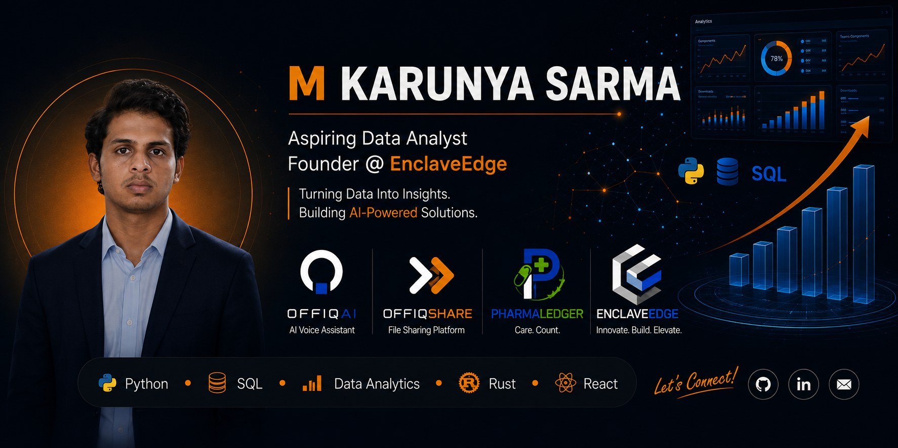

<div align="center">
  
</div>

---

<div align="center">

# M Karunya Sarma

**Aspiring Data Analyst &nbsp;·&nbsp; Founder & CEO of EnclaveEdge**

<sub>Building AI-powered products while developing expertise in data analytics and business intelligence.</sub>

<br/>

[](https://git.io/typing-svg)

<br/>

<a href="https://karunyasarma.netlify.app/"></a>
&nbsp;
<a href="https://enclaveedge.netlify.app/"></a>
&nbsp;
<a href="https://offiqshare.onrender.com/"></a>
&nbsp;
<a href="https://www.linkedin.com/in/mkarunya"></a>
&nbsp;
<a href="mailto:sarma.karunya@gmail.com"></a>

</div>

<br/>

---

## About Me

I'm a Computer Science undergraduate at Mohan Babu University with a strong focus on **data analytics**, **AI**, and **product development**. Alongside my studies, I founded **EnclaveEdge** — a technology company where I design and build software products that solve real-world problems.

I believe the most effective way to learn is by building. Every project I work on sharpens my technical skills, product thinking, and entrepreneurial instincts simultaneously.

- 📍 Based in India
- 🎓 B.Tech Computer Science — graduating 2028
- 📊 Pursuing expertise in Data Analytics & Business Intelligence
- 🏢 Founder & CEO — building multiple products under EnclaveEdge
- 🤝 Open to internships, collaborations, and opportunities in data analytics and technology

---

## Founder Journey

```
2025 ──── Started software development journey
           └─ Began learning Python, SQL, and web technologies

2026 ──── Founded EnclaveEdge
           └─ Established the company vision: AI-driven software for real-world problems

2026 ──── Launched OffiqShare
           └─ Cross-platform file-sharing platform — now live

2026 ──── Began development of PharmaLedger
           └─ Pharmaceutical inventory & management solution

2026 ──── Began development of OffiqAI
           └─ AI-powered workplace productivity platform
```

---

## EnclaveEdge

<a href="https://enclaveedge.netlify.app/"></a>

**EnclaveEdge** is a technology company building innovative software products that simplify workflows, improve productivity, and solve real-world business challenges through **AI**, **automation**, and **user-centric design**.

As Founder & CEO, I own the full product lifecycle — from identifying problems and designing solutions, to building, shipping, and iterating based on real-world feedback.

---

## Featured Products

<table>
  <thead>
    <tr>
      <th>Product</th>
      <th>Description</th>
      <th>Status</th>
    </tr>
  </thead>
  <tbody>
    <tr>
      <td><strong>🤖 OffiqAI</strong></td>
      <td>AI-powered workplace productivity platform — streamlines operations, automates repetitive tasks, and improves organizational efficiency.</td>
      <td>🔨 In Development</td>
    </tr>
    <tr>
      <td><strong>💊 PharmaLedger</strong></td>
      <td>Pharmaceutical inventory & management solution — helps healthcare businesses manage inventory, records, and operations with precision.</td>
      <td>🔨 In Development</td>
    </tr>
    <tr>
      <td><strong>📁 OffiqShare</strong> &nbsp; <a href="https://offiqshare.onrender.com/"></a></td>
      <td>Cross-platform file-sharing platform — fast, simple, and reliable file transfers across any device.</td>
      <td>✅ Live</td>
    </tr>
  </tbody>
</table>

---

## Tech Stack

<div align="center">

[](https://skillicons.dev)

</div>

---

## Skills

**Data Analytics**
&nbsp;


**Development**
&nbsp;


**AI & Automation**
&nbsp;


**Product & Entrepreneurship**
&nbsp;


---

## Current Focus

```
▸  Strengthening Data Analytics skills — Python, SQL, and visualization
▸  Building OffiqAI — AI-powered workplace productivity platform
▸  Building PharmaLedger — pharmaceutical management solution
▸  Growing OffiqShare — improving features and user experience
▸  Scaling EnclaveEdge — strategy, products, and partnerships
```

---

## Education

| | |
|:--|:--|
| 🏛️ **Institution** | Mohan Babu University |
| 📚 **Degree** | Bachelor of Technology — Computer Science |
| 📅 **Graduation** | 2028 |
| 📍 **Location** | India |

---

## GitHub Statistics

<div align="center">


&nbsp;&nbsp;


<br/><br/>


</div>

---

## Contribution Activity

<div align="center">
  
</div>

---

## Achievements

| | Achievement |
|:-:|:--|
| 🏢 | **Founded EnclaveEdge** — established a technology company focused on AI-powered software products &nbsp; <a href="https://enclaveedge.netlify.app/"></a> |
| 📁 | **Launched OffiqShare** — built and shipped a live cross-platform file-sharing platform |
| 🤖 | **Building OffiqAI** — developing an AI-powered workplace productivity platform |
| 💊 | **Building PharmaLedger** — developing a pharmaceutical inventory and management solution |

---

## Contact

<div align="center">

<a href="https://karunyasarma.netlify.app/"></a>
&nbsp;
<a href="https://github.com/karun-16"></a>
&nbsp;
<a href="https://www.linkedin.com/in/mkarunya"></a>
&nbsp;
<a href="mailto:sarma.karunya@gmail.com"></a>

</div>

---

<div align="center">

<sub><i>"Building solutions today while preparing to solve tomorrow's problems through data, technology, and innovation."</i></sub>

<br/>

<sub>Founder @ EnclaveEdge &nbsp;·&nbsp; Aspiring Data Analyst &nbsp;·&nbsp; Product Builder</sub>

<br/><br/>


</div>
